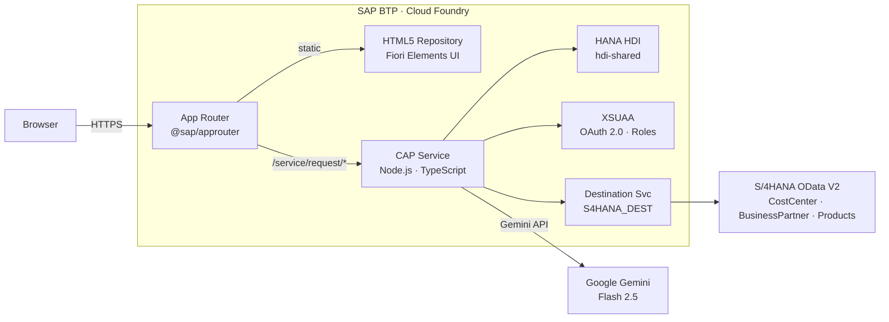
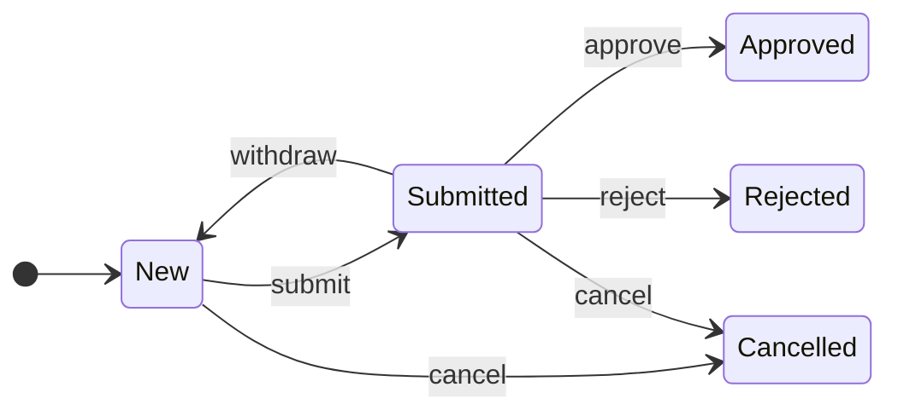

# CAPMAP — Capital Expenditure Request Management

> A full-stack enterprise application for managing CapEx purchase requests, built on **SAP CAP**, **TypeScript**, and **SAP Fiori Elements**, deployed on **SAP BTP Cloud Foundry**.

---

## Overview

CAPMAP digitizes the capital expenditure approval workflow for organizations that need a structured, auditable process for procurement requests. Employees create itemized purchase requests, route them for regional manager approval, and get AI-generated business justifications — all in a modern, mobile-ready Fiori UI backed by SAP HANA and live S/4HANA data.

**Key capabilities:**

- Draft-based request authoring with automatic line-item total recalculation
- Structured workflow — Draft → Submitted → Approved / Rejected with full audit trail
- AI-generated business justifications via Google Gemini (one-click, locale-aware)
- Regional row-level access control via XSUAA user attributes
- Live S/4HANA mashups — cost centers, suppliers, and product catalog
- Analytics charts and visual filters on the List Report
- English and Polish localization

---

## Architecture



**Request lifecycle:**



---

## Tech Stack

### Backend

| Technology | Version | Purpose |
|---|---|---|
| `@sap/cds` | ^9 | CAP framework — OData service, CDS model, event handlers |
| TypeScript | ^5 | Type-safe handler code (`tsx` runner in development) |
| `@cap-js/hana` | ^2 | SAP HANA database adapter (production) |
| `@cap-js/sqlite` | ^2 | SQLite adapter (local development) |
| `@sap/xssec` | ^4 | XSUAA token validation and user context |
| `@sap-cloud-sdk/*` | ^4.6 | Typed S/4HANA API calls via named destination |
| `@google/genai` | ^2.3 | Google Gemini AI — justification generation |

### Frontend

| Technology | Purpose |
|---|---|
| SAP UI5 ^1.145 + `sap.fe.templates` | Fiori Elements — List Report + Object Page |
| OData 4.01 | Client–service protocol |
| `cds-plugin-ui5` ^0.13 | Serves UI5 app through CDS dev server |

### BTP Services

| Service | Plan | Purpose |
|---|---|---|
| XSUAA | application | OAuth 2.0 auth and role-based access |
| SAP HANA HDI Container | hdi-shared | Persistent database |
| Connectivity | lite | S/4HANA on-premise tunneling |
| Destination | lite | Named destination lookup (`S4HANA_DESTINATION`) |
| HTML5 Application Repository | app-host / app-runtime | Hosts the Fiori static app |

---

## Project Structure

```
CAPMAP/
├── db/schema.cds                # Data model — entities, code-lists, aspects
├── srv/
│   ├── MainService.cds          # OData service — projections, actions, auth restrictions
│   ├── MainService.ts           # Handler registration
│   ├── handlers/
│   │   ├── RequestHandler.ts    # Validation, approve/reject/submit, AI action
│   │   ├── ItemHandler.ts       # itemTotal + totalAmount recalculation
│   │   ├── CostCenterHandler.ts # S/4 mashup with locale-aware names
│   │   ├── SupplierHandler.ts   # S/4 Business Partner read-through + deletion check
│   │   └── ProductHandler.ts    # S/4 product catalog with localized descriptions
│   ├── utils/PromptTemplates.ts # Gemini prompt builder
│   └── external/                # S/4HANA API definitions (EDMX/CSN — generated)
├── app/requestsui/webapp/
│   ├── manifest.json            # Fiori app config — routing, models, targets
│   ├── xs-app.json              # App-router rules for this app
│   └── annotations.cds          # All UI: facets, actions, charts, value-helps
├── app/router/                  # Global app-router entry point
├── @cds-models/                 # Auto-generated TS types — DO NOT edit
├── mta.yaml                     # BTP multi-target deployment descriptor
└── xs-security.json             # XSUAA roles, scopes, user attribute definitions
```

---

## Data Model

**`Requests`** (header) — `cuid` + `managed` + `ApprovalTracking` aspect

| Field | Type | Notes |
|---|---|---|
| `title` | String(100) | Min 5 characters |
| `totalAmount` | Decimal(15,2) | Auto-recalculated from items |
| `currency` | String(3) | Default: USD |
| `costCenter` | String(10) | S/4HANA cost center reference |
| `region` | String(2) | Row-level security key (EU / US / PL …) |
| `status` | Association | → `Statuses` code-list; default N |
| `approver` / `approvalDate` | String / DateTime | Set on workflow transitions |
| `justification` | String(500) | Manual or AI-generated |
| `rejectReason` / `cancelReason` | String(500) | Set by `rejectRequest` / `cancelRequest` |
| `aiComplianceScore` / `aiAuditNotes` | Integer / String | Set by AI compliance check on submit |
| `attachments` | Composition | `@cap-js/attachments` — required before submit |
| `items` | Composition | → `Items` (cascade delete) |

**`Items`** (line items) — `productId`, `description`, `quantity`, `price`, `itemTotal` (auto-calculated), `category` → Categories, `supplierId`

**Code-lists:** `Statuses` — N New · S Submitted · A Approved · R Rejected · C Cancelled (with criticality colours) | `Categories` — IT · FU · MA · SW

---

## OData Service

**Path:** `/service/request` | **Protocol:** OData 4.01 | **Draft:** enabled on `Requests`

### Bound Actions

| Action | Visible when | Effect |
|---|---|---|
| `submitRequest()` | status = N | Checks attachment, runs AI compliance, sets N → S (or A/R on high-confidence AI) |
| `approveRequest()` | status = S, SoD pass | Sets status → A, records approver + date |
| `rejectRequest()` | status = S, SoD pass | Sets status → R, records approver + date + reason |
| `cancelRequest()` | status = N or S | Sets status → C, records reason |
| `withdrawRequest()` | status = S | Resets status → N for re-editing; clears AI results |
| `generateAIJustification()` | Draft (editing) only | Calls Gemini, saves 2–3 sentence justification to draft |

**Validation:** `title` ≥ 5 chars · `justification` required when `totalAmount > 1000` · supplier `DeletionIndicator` checked via S/4HANA before draft activation · only N-status requests can be saved via the edit flow (`beforeSave` guard).

**Analytics:** `$apply` aggregations enabled — powers the List Report charts (groupby status / costCenter, sum / countdistinct on amounts and IDs).

---

## Authorization

| Role | Access | Region filter |
|---|---|---|
| `Viewer` | Read all requests | None |
| `RegionalManager` | Full CRUD | Only where `region = $user.Region` |

The `Region` user attribute is assigned in the BTP cockpit per role collection member. CDS enforces it automatically via `@restrict` — no handler code required.

**Dev users** (mock auth, local only):

| Username | Role | Regions |
|---|---|---|
| `admin-eu` | RegionalManager | EU, PL, EN |
| `admin-us` | RegionalManager | US |
| `readonly-user` | Viewer | — |

---

## External Integrations

| API | Used for |
|---|---|
| `API_COSTCENTER_V2` | Cost center value-help with locale-aware name / description |
| `API_BUSINESS_PARTNER` | Supplier value-help and pre-save deletion check |
| `API_PRODUCT_SRV` | Product catalog with locale-aware descriptions |

- **Development:** Direct `sandbox.api.sap.com` URLs + `S4HANA_API_KEY` from `.env`
- **Production:** Named destination `S4HANA_DESTINATION` via BTP Destination Service

**Gemini AI:** model `gemini-3-flash-preview` · key `GEMINI_API_KEY` in `.env` · prompt in `srv/utils/PromptTemplates.ts`

---

## Local Development

### Prerequisites

- Node.js 20+, SAP CDS CLI (`npm install -g @sap/cds-dk`)
- `.env` file in the project root:

```env
GEMINI_API_KEY=your_google_gemini_api_key
S4HANA_API_KEY=your_sap_sandbox_api_key
```

### Start

```bash
npm install
cds watch                       # dev server at localhost:4004 (SQLite, mock auth)
npm run watch-requestsui        # same + auto-opens the Fiori app in the browser
npm run seed:attachments        # attach a test PDF to every request (dev data)
```

After any change to `.cds` model files, regenerate TypeScript types:

```bash
# global CDS CLI:
cds-typer '*' --outputDirectory @cds-models

# Windows (local install, avoids shebang crash):
node node_modules/@cap-js/cds-typer/lib/cli.js "*" --outputDirectory @cds-models
```

---

## Fiori UI

**Template:** Fiori Elements List Report + Object Page — all layout driven by `annotations.cds`, no custom view XML.

| Page | Entity |
|---|---|
| List Report | `Requests` |
| Request Object Page | `Requests` (draft-enabled) |
| Item Object Page | `Items` (nested in draft) |

**Notable features:** visual filter bar (mini charts for Status + CostCenter + Created Date) · analytics tab (column + donut charts) · contextual action buttons (Submit / Approve / Reject / Cancel / Withdraw — shown per status) · AI button (draft only) · value-helps loaded live from S/4HANA · side effects refresh totals and justification on save · `@odata.draft.bypass` enables mass inline editing.

---

## Deploying to SAP BTP

```bash
npm run build               # produces mta_archives/CAPMAP_1.0.0.mtar
cf deploy mta_archives/CAPMAP_1.0.0.mtar
```

MTA deploys in order: HANA HDI artifacts → CAP service → Fiori app (HTML5 repo) → app-router.

After deploy, assign role collections in the BTP cockpit:

| Role Collection | Notes |
|---|---|
| `CAPMAP-Viewer` | Read-only |
| `CAPMAP-RegionalManager` | Set the **Region** attribute (e.g. `EU`) |

For handler patterns, code examples, and troubleshooting see [DEVELOPMENT.md](DEVELOPMENT.md).

---

## License

Private — internal use only.
